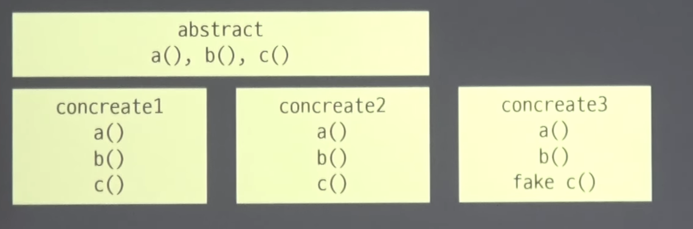

# 오브젝트 6장

디미터 법칙

Tell don't ask,  헐리우드 법칙

묻지 말고 시켜라

상대의 상태를 안 순간 일이 복잡해짐 ( 소개팅을 시켜주려고 했는데, 처음에는 미혼이었으나 갑자기 기혼이 되어버릴 수  있다. )

리스코프 치환 원칙

자식형을 안전하게 부모형을 대체할 수 있게 한다.

`성급한 추상화` 문제 

→ 일반적으로 해결하려고 하는 방식 때문에 Context 에러 발생




리스코프 치환원칙에 축소문제가 발생하면 ⇒ 추상계층을 추가해서 해결


리스코프 치환 원칙에 확장문제가 발생하면, (OCP)OpenClosed 원칙이 문제가 생김, Generic을 통해서 해결 

# 개발자의 세계

Director →  (Paper와 Programmer를 연결)

Paper → ServerClient 

→ Client

Programmer → BackEnd

→ FrontEnd

```csharp
public interface Paper {}
```

```csharp
public interface Programmer {
	Program makeProgram(Paper paper);
}
```

```csharp
public class Client : Paper {
	Library library = new Library("vueJS");
	Language language = new Language("kotlinJS");
	Programmer programmer;
	public void setProgrammer(Programmer programmer){
		this.programmer = programmer;
	}
}
```

```csharp
public class ServerClient: Paper {
	Server server = new Server("Test");
	Language backEndLanguage = new Language("java");
	Language frontendLanguage = new Language("kotlinJS");
	private Programmer backEndProgrammer;
	private Programmer frontEndProframmer;

	public void setBackendProgrammer(Programmer programmer){
		this.backEndProgrammer = programmer;
	}

	public void setFrontProgrammer(Programmer programmer){
		this.frontEndProgrammer = programmer;
	}
}
```

```csharp
public class FrontEnd : Programmer {
	private Language language;
	private Language library;
	
	public Program makeProgram(Paper paper){
		if(paper instanceof Client){
			Client pb = (Client)paper;
			language = pb.language;
			library = pb.library;
		}
		return makeFrontEndProgram();
	}
	private Program makeFrontEndProgram(){ return new Program();}

```

paper가 마커 인터페이스이기 때문에 아무런 정보를 얻을 수 없다.

```csharp
public class BackEnd : Programmer{
	private Server server;
	private Language language;
	
	public Program makeProgram(Paper paper){
		if(paper instancof ServerClient){
			ServerClient pa = (ServerClient)paper;
			this.server = pa.server;
			this.language = pa.language;
		}
		return makeBackEndProgram();
	}

	private Program makeBackEndProgram() { return new Program();} 
}
```


if문은 컴파일, 런타임 에러를 발생시키지 않는다.

if, 다운캐스팅을 했기 때문에 테스트 케이스를 1000개를 만들어도 1001번 째 에러를 만든다.

컨텍스트 에러의 정의를 다시 찾아보자.

LSP, OCP를 지키려고 하면 나머지 3개가 다 지켜짐

LSP지키기가 너무 어려워

LSP의 확장 문제를 해결할 줄 알아야 한다.

# LSP위반 시행 착오


LSP를 위반하고 있는 부분, 다운 캐스팅을 하면 OCP유발

LSP가 위반 되면 100% OCP위반을 유발!!!

Tell, Don't Ask

내가 구체적인 내용을 알려고하지말고 떠밀어!

페이퍼야 넌 클라이언트 형이니?

페이퍼야 언어가 뭐야? 페이퍼야 라이브러라기 뭐야?  


데이터를 셋 해줘!

어설프게 객체지향을 배우면 하는 실수다 , 위 사진은

백엔드 개발자도 마찬가지로 변경


템플릿 메소드 패턴으로 공통 부분을 추상층으로 올림

중복이라고 판단되면 훅(getProgram)으로 올림


참담하다 Paper가...


setData를 인터페이스에 추가하게 된다.

Programmer에서 OCP를 지키려고 Paper에게 다 미뤄버렸다.

이제는 Paper가 난리가나버림

이제 컨테스트 에러가 Paper에서 발생

LSP는 늘어나는 예에는 효과적으로 적용하기 힘들다.

추상층이 가지고 있는 정보는 적기 때문에 다운캐스팅이 발생하는 상황이 자주 발생(실무)


인터페이스에 메소드가 2개 이상이면 그건 성급한 추상화다!

그런데 추상화가 알고있는게 적다면 LSP를 위반하게 된다. → 어쩌라는거야?

ServerClient는 더 심각하다.


프로그래머의 종류가 2개 이상이 들어온다.

아까 클라이언트 페이퍼는 1:1 관계였지만, 서버 클라이언트 페이퍼는 1:다 관계다.(페이퍼가 프로그래머를 알게 했더니)

여러 프로그래머가 setData를 돌렸을 때 모두 성립해야한다. 책임이 막중하다. (프로그래머가 처리하는 것 보다 더 복잡하다)

잘못 밀었더니 더 복잡해졌다.

메소드의 존재 의무는 클라이언트, 사용자에게 제공 하는 서비스다. 한 컨텍스트(ex class)내에서만 사용된다고 생각하지마라. 

경우의 수가 확실히 1개다! 라고 가정되어 있다면 틀린 경우가 아니긴 하다(Client paper)

# 제네릭 사용!

이 문제를 해결할 수 있는 언어적 수단. → 제네릭


추상형을 유지하면서 구상형을 클라이언트가 결정하게 해주는 로직

if문과의 차이점 → 형으로 결정한다!

런타임, 컨텍스트 문제를 컴파일 타임으로 문제를 옮길 수 있다. ⇒ 진짜 중요한듯, 이거 때문에 사용하는 거 같아

instanceof가 코드에서 발견되면 제네릭으로 해결해라.


제네릭이 해주는 건 instanceof를 제거해주는 것 까지 해준다.

BackendProgrammer를 넘기면 이제 `컴파일 타임`에 에러가 난다.

코드는 클라이언트 즉 디렉터 코드에 존재

OCP도 어기지 않고 LSP도 어기지 않았다.

우리는 if문을 해결하려면 if의 갯수만큼 형을 만들어야 한다.

## 그런데 2개와 맵핑이 되어야 하면 어떻게 하지? 2개인건 어떻게 확신하는가?


# OCP와 제네릭을 통한 해결

→ 헐리우드 법칙이다.

일단 Paper를 다시 되돌린다.  Programer가 Paper를 알게

1:N관계를 1:1 관계를 여러개 만드는 것으로  바꾼다.

한 명이 여러개를 알게 하면 안된다.

parent가 child배열을 가지게 하면 안된다. 의존성의 무게가 다르다.

자식이 부모를 알게 하는게 의존성이 더 가볍다.


setData의 책임을 내가 가져가겠다.

T에 대한 책임은 자식에게 떠넘기겠다.

헐리우드 법칙 → 부모 자식관계에도 통한다.


이제 백엔드 개발자를 보자. 수많은 종류의 백엔드 개발자가 있다.

어떤 관점에서 다르냐? → Paper에 따라 다르다.

제네릭이 개입하면 추상화가 깨지는게 아니라 제약이 걸린다.

이전 시도는 클라이언트에게 넘긴게 아니라, Paper(같은 책임 레이어를 가진 방향)으로 토스한 것이다.


프론트엔드 개발자도 평화롭다.

# 클라이언트의 변화


다른 객체안의 if문도 제거하면서 client입장이 director에서도 if문이 제거되었다. 어떻게? → 형을 결정해서

c#일경우 FrontEnd, BackEnd 추상클래스를 상속하는 클래스를 하나 더 만들어서 생성


클라이언트도 잘 적용되어있다.

이제 디렉터에 있는 instanceof를 제거해야하는데, 디렉터는 제네릭으로 해결할 수 없다. 많은 프로젝트를 소유하고 있기 때문에,


디렉터의 OCP위반

디렉터의 책임을 Paper에게 넘김


서버클라이언트랑 클라이언트는 더이상 구상 클래스가 아니라 추상클래스로 바뀌게 된다.

if문을 제거하기 위해서는 그만큼 형을 만들어라!!

책임은 그대로 가져가지만, 수행하는 방법에따라 형을 다르게 만들꺼기 때문에, 반드시 형을 만든다음에 할당을해야한다. 가장 구체화된 케이스를 만들어서 할당


이제 project들을 받아서 수행하기만 한다.

이제 projects의 분기, 구체화된 케이스를 주입받는 역할을 Main까지 넘긴다.

이제 모두 메인에게 넘기게 되면 DI가 가능해진다.


메인에서 수행방법을 기술만하면된다. 여기서 내부 오버라이드는 다 다른 형이다.


퍼블릭(세터)에서 프로텍티드로 보호단계가 올라감 setProgrammer라는 클래스가 필요 없어짐


퍼블릭(세터)에서 프로텍티드로 보호단계가 올라감 setFrontEndProgrammer, setbackEndProgrammer라는 클래스가 필요 없어짐

디렉터가 추상형이 아니라 구상형이기 때문에, 인터페이스의 메소드로 올라갈 수 있다.

디렉터가 추상화였으면, 페이퍼가 디렉터 T를 받을 것이다. 그리고 run메소드는 디렉터 구상형으로 이동할 것이다.

어느쪽이 무겁냐, 어느쪽이 더 확장적이냐에따라서 코드의 배치가 변경된다.

지금은 페이퍼가 가볍기 때문에, 형을 주입하는 코드들이 페이퍼에 위치한다.

아까 시도로 프로그래머에게 있었는데, 1:N관계가 만들어져서 문제가 발생했었다.

기계적인 매핑, 훈련해라!

if는 context에러를 발생시킨다. if문을 제거하면 좋다. 근데 제거가 불가능 그렇다면 컴파일 타임으로 문제를 옮기자. 또는 클라이언트쪽으로 밀어내자.
