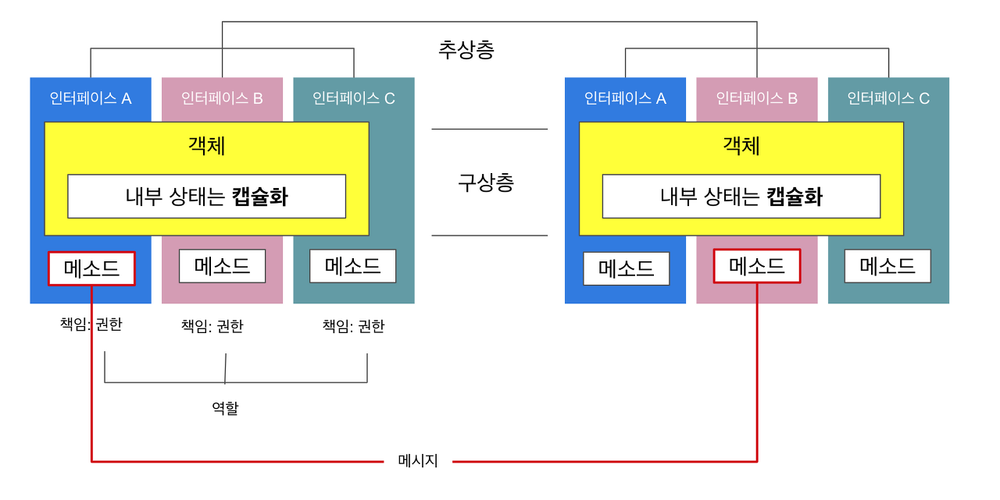

	# 오브젝트 5장

# 객체간 통신

---



현실세계 객체는 하나의 책임을 갖는 것은 불가능하다.

즉, 다양한 책임(메소드)을 가지고 있는 다양한 역할(인터페이스)를 수행하게 된다.

`메세지통신`은 어느 객체에 책임이 다른 객체의 책임과 통신하는 것이다.

# 통신망의 구성


객체 통신은 동기뿐만 아니라 비동기를 포함해서 다양한 다른 Type 사이에 대화하는 복잡한 형태로 되어 있다.

협력이라는 문맥안에서 객체망과 메시지의 조합으로 표현할 수 있는 것이 객체 설계이다.

# 순환 객체망


일반적으로 `순환하는 망`이 생기면 잘못된 것이다.

실무에서는 망이 너무 방대하기 때문에 순환을 파악할 수 없다.

이 책에서 코드 설계란 `코드 배치의 기술`이라고 설명한다.

결국 코드 배치를 잘 해서 의존성을 단방향으로 만드는 것이 목표다.

# 인터페이스의 그룹화

수 많은 관점(interface에 따라 책임(method)이 도출된다.


하나의 객체라도 도메인 또는 바라보는 관점에 따라서 다른 인터페이스를 가지고 있는 것이다. 그래서 어렵다.

### 여러 간점을 수용하는 객체

자신이 소속되어 있는 관점마다 다양한 inteface를 부분적으로 가지고 있다.

### 상호작용

객체망을 구성해서 서로 모순점이 생기거나 잘못된 Interface가 발견되면 "인터페이스의 그룹화"까지 영향을 미치게된다.

소프트웨어 개발의 역사는 그리 길지 않다. 약 100년 가까이 되었는데, 그 사이에 이미 많은 천재들은 좋은 설계방법을 사용하고 있었다. 그러나 일반적인 사람들은 머리가 그렇게 좋지 못해서 따라가지 못한다. 결국 똑똑한 사람들이 최소한 이정도는 지켜라. 하고 만들어낸 설계 규칙이 있다. 바로 SOLID 

# SOLID

- SRP : 단일 책임 원칙
    - 변화의 이유를 하나만 가져야 한다.
    - 객체를 분리해서 만드는 이유가 변화율에 따라야 한다 ⇒ `변화율에 따른 격리`
        - 변화율이란 코드가 `변화하는 시간적인 의미`도 있지만 `변화하는 이유`도 포함이다.

    만약 SRP원칙을 위반했다면?

    - 산탄총 수술
        - 한가지 변화 이유로 코드를 수정하면서 수많은 클래스를 수정하게 되는 현상
- OCP :개방폐쇄 원칙
    - 타입에서는 열려있고 변경에는 닫혀있다.
    - 포인터를 직접참조하지말고 포인터의 포인터를 사용하자! ⇒ GRASP의 Indirection과 비슷
    - 해결해야하는 문제
        - Main Partition
            - if-else문을 클라이언트측 (main)으로 미뤄내야한다.
        - Crystal Ball Problem
            - 미래의 변경을 알 수 없기 때문에 추상화 설계를 하기 어렵다.
    - [좋은 글](https://kimtaesu.gitbook.io/workspace/undefined/14.1.-ocp-open-closed-principle)
- LSP : 리스코프 치환 원칙
    - 업캐스팅이 안정이 되야 한다. = 자식이 부모자리를 대체할 수 있어야 한다.
    - 추상층의 정의가 너무 구체적이면 구상층의 구현에서 모순이 발생한다.
    - 추상층은 구상층의 확장을 포용할 수 있는 교집합만 가지고 있어야 한다.
    - LSP가 지켜져야 OCP가 지켜진다.
- ISP : 인터페이스 분리의 원칙
    - 구상형으로 쓰지말고 인터페이스로 분리해야함
- DIP : 의존성 역전의 법칙
    - 구상층에 의존하지 말고 추상화 된 것에 의존해야한다.
    - 다운캐스팅을 하면 안된다.

# 그 밖에 필요하다고 생각되는 원칙들

DI (ioc) - 의존성 역전

Dry - 중복 방지

Hollywood 원칙 - 묻지말고 시켜라 (Tell, Don't ask)

디미터의 법칙 - 최소 지식(객체 내부 구조에 강하게 결합되지 않도록 협력 경로를 제한하는 것)

screening.getMoive().getDiscountConditions()

### Hollywood 원칙, 디미터의 법칙 모순점

두 원칙을 지키면 해당 객초ㅔ 메시지를 주고 받는 것은 가능하나 내부를 들여다 볼 방법이 없음

객체 통신망 - 객체는 메시지를 주고 받는다.

메시지를 정상적으로 수신되었는지? 어떻게 알 수 있을까?

코드상으로 객체 간 통신은 Runtime Time에서 일어나기 때문에 정상적으로 통신이 이루어졌는지는 확인할 수 없다.

### 결국 객체가 제대로 작동하는가를 테스트하려면...?

1. 객체통신망에서 테스트할 객체에게 메시지를 보낸 뒤
2. 그 객체가 이웃 객체에게 메시지를 잘 보냈는지 확인
3. 3번을 위해 통신한 이웃 객체를 조사하면 된다.

즉, Mock 객체를 활용하여 Unit test를 작성하고 특정 함수가 호출되었는지를 검증해야함!

# GRASP

책임을 부여하는 패턴

원칙수준 보다는 이렇게 하는 것이 좋다 라는 의미로 사용하면 된다.

- Information Expert
    - 해당 책임에 대한 데이터를 가장 많이 가지고 있는 객체가 책임을 할당받는다.
    - 객체의 본질과 데이터 은닉을 지킬 수 있는 패턴
- Creator
    - 객체의 생성은 생성되는 객체의 컨텍스트를 알고 있는 다른 객체가 있다면, 컨텍스트를 알고 있는 객체에 부여
    - 객체 시스템이 이질적인 부분인 생성시에도 정보전문가 패턴을 따르자!
    - 어떤 객체가 대상을 포함, 이용, 부분으로 삼거나 잘 알고있다면 생성 책임 부여
    - A와 B의 객체의 관계가 다음 중 하나가 포함된다면 B에게 A객체를 생성하는 책임을 부여
        - B 객체가 A 객체를 포함하고 있다.
        - B 객체가 A 객체의 정보를 기록하고 있다.
        - A 객체가 B 객체의 일부이다.
        - B 객체가 A 객체를 긴밀하게 사용하고 있다.
        - B 객체가 A 객체의 생성에 필요한 정보를 가지고 있다.
    - Factory Pattern
- Controller
    - Mediator Pattern + Adaptor Pattern
    - 시스템 이벤트(사용자 요청)을 처리할 객체를 만든다.
    - 서브 시스템으로 묶을 수 있다면 컨트롤러를 도입!
    - 레이어 계층 사이에 둬서 각 레이어 계층이 서로를 몰라도 되게 한다.
    - 객체들은 더 이상 다른 객체와 서로 직접 통신하지 않으며 대신 중재자를 통해 통신한다.
- Low Coupling & High Cohesion
    - Low Coupling
        - 객체들간의 의존성을 낮추자.
        - 알고 있는 객체의 수가 적어야 한다.
        - 각 객체의 재사용성을 높인다.
        - 시스템 관리를 편하게 만들어준다.
    - High Cohesion
        - 본인이 해야할 역할만 수행한다
    - 자신의 역할에만 충실하다보면 알고 있는 객체의 수도 적어질 것이다.
    - 단방향 의존성
- Polymorphism
    - 전략 패턴
    - 객체의 종류에 따라 행동양식이 바뀐다면 사용하라.
    - 만약 객체마다 행동이 다르다면 if문을 사용하지말고 다형성을 사용하라.

    ```csharp
    public abstract class 동물 { abstract void cry(); };
    public abstract class 사자 { void cry() { Console.Log("어흥");}}
    public abstract class 참새 { void cry() { Console.Log("짹짹");}}

    public class Main{
    	void Start()
    	{
    		cry(new 사자());
    		cry(new 참새());
    	}

    	void cry(동물 animal)
    	{
    		animal.cry();
    	}
    }
    ```

    ```csharp
    public class Main{
    	void Start()
    	{
    		cry("사자");
    		cry("참새");
    	}

    	void cry(string animal)
    	{
    		if(animal == "사자")
    			Console.Log("어흥");
    		else if(animal == "참새")
    			Console.Log("짹짹");
    	}
    }
    ```

- Puree Fabrication
    - 공통된 기능이나 순수 기능적인 객체는 따로 모아서 작성한다. (ex, Logging)
    - 도메인에 관련된 문제를 대표하는게 아니라면 기능적인 책임을 별도로 한 곳으로 관리하는 객체를 만들자.
        - 데이터베이스 정보를 저장하거나, 로그 정보를 기록하는 책임에 대해 생각해보자. 각 정보는 각각의 객체들이 가지고 있을 것이다.
        - Information Expert패턴을 적용하면?
            - 각 객체들이 정보를 저장하고, 로그를 기록하는 책임을 할당해야 하지만, 실제로 그렇게 사용하는 사람들은 없다.
    - 시스템 전반적으로 사용하고 있는 기능을 변경한다면?
        - 모든 객체를 수정해야 하는 결과를 가져온다.
        - 즉, Low Coupling 규칙을 깨버리게 된다.
            - 이럴 경우 공통적인 기능을 제공하는 가상의 객체, 서브 시스템을 만든다.
- Indirection
    - 두 객체 사이의 직접적인 Coupling을 피하고 싶으면, 그 사이에 다른 매개체를 통해 전달하는 것
    - 주로 다른 매개체는 interface인 경우가 많다.
        - 특별한 경우는 아래 Protected Variation
    - SOLID의 OCP원칙
- Protected Variation
    - 변경될 여지가 있는 곳에 안정된 Interface를 적용하자.
    - 추상적인 수준에서 책임을 정의하여 다양한 구상가능성으로 부터 사용할 모듈을 보호하라.
