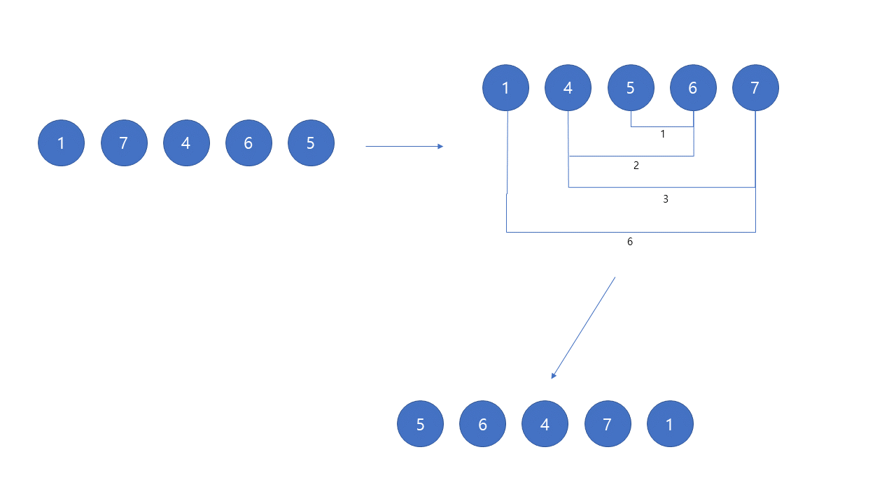

알면 매우 쉽지만 모르면 어려운
==================================

## Codefroces Round #633(Div. 2) B번
[본 문제](https://codeforces.com/problemset/problem/1339/B)

문제를 간단하게 설명하자면 배열의 크기 N과 배열의 크기만큼 수열을 줍니다. 

이 수열을 |a1−a2|≤|a2−a3|≤…≤|an−1−an| 조건에 해당하는 배열로 만드시면 됩니다.

Ex) 1 7 4 6 5 수열은 5 6 4 1 7 수열로 변할 수 있습니다.
|5-6| <= |6-4| <= |4-1| <= |1-7|
아시는 분은 구두로 간략하게 말씀해주시면 되겠습니다. 

해설

정답 코드

<pre>
<code>

int main(){

    int T;
    cin >> T;
 
    while(T--){
        int N;
        cin >> N;
        
        vector<int> v(N);
        for(int i = 0; i < N; i++)cin >> v[i];
 
        sort(v.begin(), v.end());
        int pointer1 = -1;
        int pointer2 = 0;
        int cur = N/2;
        for(int i = 0; i < N; i++){
            if(i & 1){
                cout << v[cur+pointer1--] << ' ';
 
            }
            else{
                cout << v[cur+pointer2++] << ' ';
            }
        }
        cout << '\n';
    }
}
</code>
</pre>

Centroid Decomposition이란?
==========================